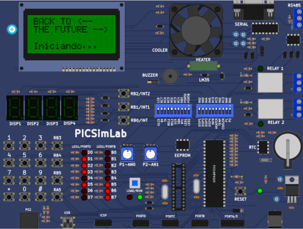

<h1 align="center">Delorean - Simulador</h1>

   <a href="#-Sobre">Sobre</a>&nbsp;&nbsp; | &nbsp;&nbsp;
   <a href="#-Funcionalidades">Funcionalidades</a>&nbsp;&nbsp; | &nbsp;&nbsp;
   <a href="#-Observações">Observações</a> &nbsp;&nbsp; | &nbsp;&nbsp;
   <a href="#-Disciplina">Disciplina</a>

  

## 🔖 Sobre
  O projeto final de Embarcada foi realizado utilizando a linguagem C. Seu desenvolvimento teve como principal objetivo a utilização de 5 funcionalidades presentes na placa periférica estudada durante o curso. 
  Uma brincadeira com a história da trilogia De volta para o futuro, onde o usuário escolhe o ano de destino e as placas funcionam respectivamente à sua decisão, transportando o usuário ao ano desejado, usando as configurações criadas e sua imaginação.
  
## 💾 Funcionalidades
 - LCD
 - Display de 7 segmentos
 - Teclado
 - Buzzer
 - Cooler
 - Linguagem C
 
## 📰 Observações
   Alguns problemas foram encontrados durante o desenvolvimento do trabalho, como conflito do cooler com o teclado, display de 7 segmentos com flicker, e a não leitura da tecla através de uma função para isto. Apenas o cooler com o teclado que me impediu de implementar mais ao trabalho, pois não encontrei uma solução, entretanto, as outras duas dificuldades foram solucionadas.
    
